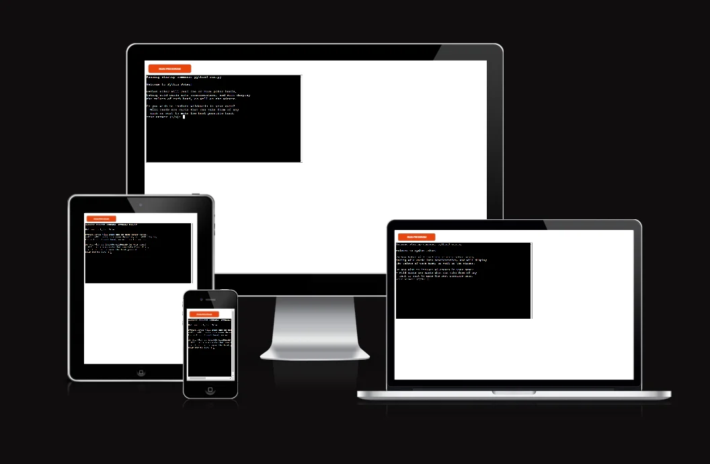

# Python Poker

## What is it?

Python Poker is a command-line program that requests a set of poker hands from the user and calculates the value of each hand ([See full list of hand values](https://en.wikipedia.org/wiki/List_of_poker_hands)).

If more than one hand is given, the winner will be displayed after every hand input.

This program is designed to help players that aren't too familiar with the rules of poker learn how to read their hand, as well as remove any uncertainty in determining the winner of a poker game.

This program has been deplyed to Heroku and can be found [here](https://python-poker-272a987b7d1f.herokuapp.com/).

## Features

### User Interface

### Content

## Data Model

## Testing

### Bugs

### Manual Testing

### Validator Testing

### Unfixed Bugs

## Deployment and Local Development

### Deploy on Heroku

### Cloning Repositories

### Forking Repositories

## Credits