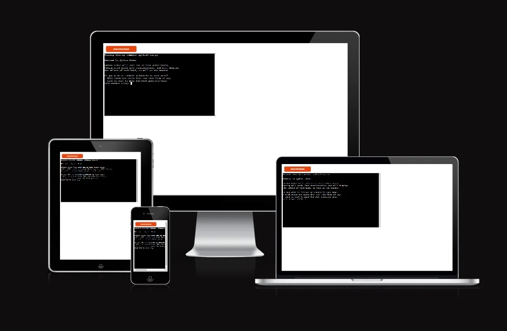
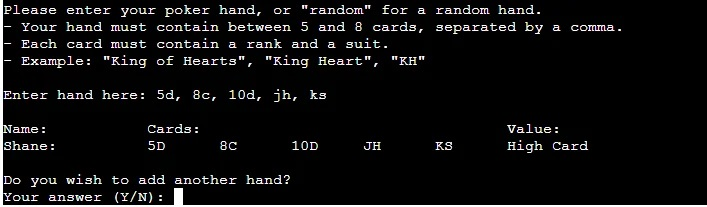
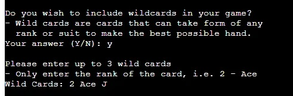
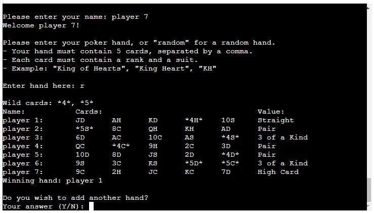
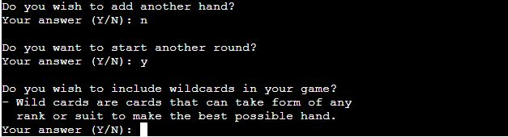
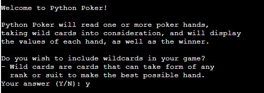
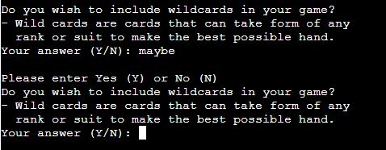
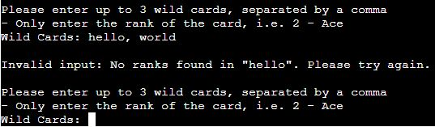
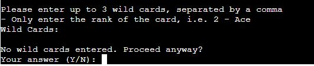

# Python Poker

## What is it?

Python Poker is a command-line program that requests a set of poker hands from the user and calculates the value of each hand ([See full list of hand values](https://en.wikipedia.org/wiki/List_of_poker_hands)).

If more than one hand is given, the winner will be displayed after every hand input.

This program is designed to help players that aren't too familiar with the rules of poker learn how to read their hand, as well as remove any uncertainty in determining the winner of a poker game.

This program has been deplyed to Heroku and can be found [here](https://python-poker-272a987b7d1f.herokuapp.com/).

## Features

### Content

- Python Poker can read hands of 5 to 8 cards, using the best 5 cards out of the hand

- Up to 3 wild cards, which are special cards that can take form of any rank or suit, can be included and specified by the user
- Wild cards consist of card ranks that already exist in the deck, i.e. 2 - Ace, and will replace these card ranks for the round
- These are commonly used in poker games, and can be tricky for new players to decide what type of card is best used in place of them, so they were included to inform the user the best hand they can make with them

- The user can add as many players as they like, as long as there are enough cards in the deck to accomodate them
- The winner will be determined each time a new hand is entered. If 2 players have the same hand value, the player with the highest ranking cards will win

- Once the round has concluded, the program will give the option to start an entirely new round, and will continue doing so until the user ends the program

### User Interface

- **Introduction and Wild Cards**
    - Python Poker begins with a short paragraph clearly stating its purpose to the user
    - The paragraph was kept short to prevent overwhelming the user with information upon starting the program
    - Sections of text are often separated by a blank line to further improve readability
- 
    - The user is first asked if their current round of poker includes wild cards. This is a simple yes/no question, which is clearly stated beside the answer input
    - If the user responds with an answer that does not resemble "Yes" or "No", a message that explains this error will appear and the user will be asked again, until a yes/no answer is detected
- 
    - If the user answers with no, then the wild cards section will be skipped and the program will move on to the next section
    - If answered with yes, the user will be asked to enter their wild cards, requesting each card to be separated by a comma
    - If the user does not follow the instructions, or makes a mistake, the user will be notified of the issue and will be asked to enter their input again
- 
    - If the user does not enter any values, they will be asked if they want to proceed without wild cards
    - This is done in case the user changed their mind about including wild cards in their game after saying yes
- 

### Future Features

## Data Model

## Testing

### Bugs

### Manual Testing

### Validator Testing

### Unfixed Bugs

## Deployment and Local Development

### Deploy on Heroku

### Cloning Repositories

### Forking Repositories

## Credits