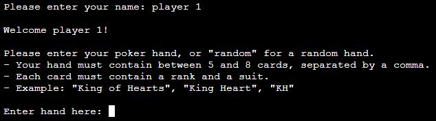

# Python Poker

## What is it?

Python Poker is a command-line program that requests a set of poker hands from the user and calculates the value of each hand ([See full list of hand values](https://en.wikipedia.org/wiki/List_of_poker_hands)).

If more than one hand is given, the winner will be displayed after every hand input.

This program is designed to help players that aren't too familiar with the rules of poker learn how to read their hand, as well as remove any uncertainty in determining the winner of a poker game.

This program has been deplyed to Heroku and can be found [here](https://python-poker-272a987b7d1f.herokuapp.com/).

## Features

### Content

- Python Poker can read hands of 5 to 8 cards, using the best 5 cards out of the hand

- Up to 3 wild cards, which are special cards that can take form of any rank or suit, can be included and specified by the user
- Wild cards consist of card ranks that already exist in the deck, i.e. 2 - Ace, and will replace these card ranks for the round
- These are commonly used in poker games, and can be tricky for new players to decide what type of card is best used in place of them, so they were included to inform the user the best hand they can make with them

- The user can add as many players as they like, as long as there are enough cards in the deck to accomodate them
- The winner will be determined each time a new hand is entered. If 2 players have the same hand value, the player with the highest ranking cards will win

- Once the round has concluded, the program will give the option to start an entirely new round, and will continue doing so until the user ends the program

### User Interface

- **Overview**
    - All bodies of text instructing the user on how to navigate through the program are kept as short as possible to prevent overwhelming the user with information
    - Sections of text are separated by a blank line to improve readibility
- **Wild Cards**
    - The user is first asked if their current round of poker includes wild cards. This is a simple yes/no question, which is clearly stated beside the answer input
    - Wild cards are requested before any player hands because all hands share the same wild cards
- 
    - If the user responds with an answer that does not resemble "Yes" or "No", a message that explains this error will appear and the user will be asked again, until a yes/no answer is detected
- 
    - If the user answers with no, then the wild cards section will be skipped and the program will move on to the next section
    - If answered with yes, the user will be asked to enter their wild cards, requesting each card to be separated by a comma
    - If the user does not follow the instructions, or makes a mistake, the user will be notified of the issue and will be asked to enter their input again
- 
    - If the user does not enter any values, they will be asked if they want to proceed without wild cards
    - This is done in case the user changed their mind about including wild cards in their game after saying yes
- 
- **Getting the User's Hand**
    - Upon receiving the list of wild cards from the user (if any), the program will move on to request the poker hands
    - Each hand requires the name of the player with that hand, so the name of the winner can be displayed for each entry
- 
    - Names can be up to 12 characters, and cannot exist more than once
- 
    - After a valid name has been entered, this new player will be welcomed and asked to enter the cards in their hand
    - The program clearly states the hand must contain between 5 and 8 cards, each being separated by a comma, and must contain a rank and a suit
- 
    - Once a hand has been entered, all future hands must have the same amount of cards as the first hand. This will be updated in the instructions
- 
- **Reading the User's Input**
    - Once the user enters their list of cards, each card will be checked for a rank and a suit.
    - The characters of the input are compared to the characters of each rank and suit. If at least 75% the input's characters also exist in the rank or suit it is evaluating, then the program assumes the user meant to enter that rank/suit. However, the first character has to be the same.
    - This feature allows the text input to be more forgiving to spelling mistakes, and makes the program much easier to use for people with dyslexia
- 
    - If the text input consists of only one word, the characters of the rank and suit will be searched for through the input, attempting to find the best matching rank and suit
- 
    - This type of word evaluation is done with every input request that is looking for a word, which greatly improves the usability throughout the program
- **Displaying the Hands**
    - Once a valid hand has been entered, a table containing all of the entered hands will be displayed
    - If more than one hand exists, the winner will be added under the table
    - Wild cards are highlighted in asterices (*). To remind the user these cards are wild, the list of wild cards stated above the table is also highlighted in this way
    - The table is laid out in a way that can display a lot of information in an easy to read manner, without requiring the user to scroll through the terminal
- 

### Future Features

- A communal set of cards that are used by all players, for example, the "Flop", "Turn" and "River" in Texas Hold'em
- Joker cards that can be added in the wild cards section
- The option for the user to see every rank and suit to help very new poker players enter their hand
- An explanation as to why a hand has a certain value, and the percentage chance to get such a hand
- An in-depth explanation for why a particular player won

## Data Model

## Testing

### Bugs

Bug #1 (8/8/23): "TypeError: 'in `<string>`' requires string as left operand, not int" error displays when getting the rank of a card
- Expected result: There should be no TypeError when finding the card rank
- Solution: If an input is just a number, then it will be declared as an integer. Use the `str()` function on the value to fix this

Bug #2 (8/8/23): Console is printing None when printing the cards after validation
- Expected result: The console should only print the cards
- Solution: Human error. I passed the `Hand.print_hand()` function as an argument for the `print()` function.
However, this function is a void function and returns no values, which is why the console printed "None" at the end.
To fix, remove the print function and just call `Hand.print_hand()` on its own

Bug #3 (16/8/23): Hands with wild cards are returning better values than they actually have
- Expected result: Wild cards should accurately give the best hand the player can make with them
- Solution: The algorithm for checking how many repeating ranks occur in a hand was using the unsorted hand list, which contained the wild cards.
This meant that if the hand contained multiple wild cards, then the wild cards themselves would be considered as pairs.
Then the wild cards would be added on top of those cards effectively doubling those cards according to the hand evaluation.
To fix this, check the sorted list, which has the wild cards removed from it, for repeating ranks instead.

Bug #4 (25/8/23): Wild cards not saving once round starts
- Expected result: Wild cards should remain until a new round has started
- Solution: The deck is stored in a global variable. on `start_round()` call, this variable was set to a new instance of Deck each round.
This way of doing it resulted of a different local variable, leaving the global variable unchanged.
To fix this, call the deck instance's own function `get_full()`, which returns a list of all 52 cards in a deck, and set it's cards to what it returns

Bug #5 (25/8/23): User can enter blank player name by entering only a space
- Expected result: Player names must contain at least 1 character
- Solution: Strip the input of any white space using the `strip()` function

### Manual Testing

### Validator Testing

Python Poker was tested using [Code Institute's pep8 Validator](https://pep8ci.herokuapp.com/) and contains no issues

### Unfixed Bugs

## Deployment and Local Development

### Deploy on Heroku

### Cloning Repositories

### Forking Repositories

## Credits