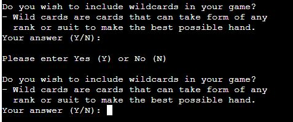

# Manual testing of Python Poker

## Introduction

There are several sections of Python Poker that require user input, each having their own set of rules for the data to be valid

For each input, the following will be tested:
- No input will be given
- An input only containing white space (" ") will be given
- Each rule will be broken, depending on the section
- Every valid input will also be entered to ensure they work

## Section 1: Yes or No Questions

Upon starting the program, the user is first asked a yes or no question on whether they want to include wild cards in their round.

Rules:
- 75% of the characters of the input must contain "Yes" or "No"

**Test 1: No input**

