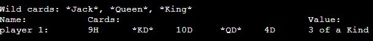
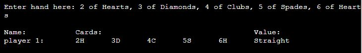
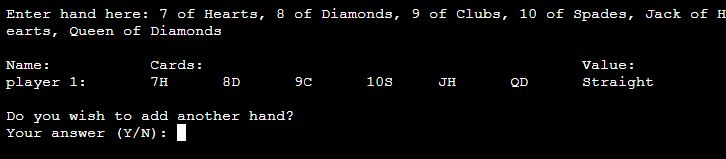
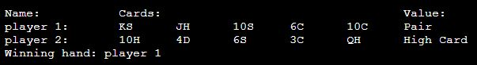

# Manual testing of Python Poker

## Introduction

There are several sections of Python Poker that require user input, each having their own set of rules for the data to be valid

For each input, the following will be tested:
- No input will be given
- An input only containing white space (" ") will be given
- Each rule will be broken, depending on the section
- Every valid input will also be entered to ensure they work

For the purposes of testing Python Poker, the following will be defined as:
- *Invalid input*: Any input that asks the user to re-enter their input, correcting their mistakes
- *Valid input*: Any input that triggers the program to move to a different section

## Section 1: Yes or No Questions

Upon starting the program, the user is first asked a yes or no question on whether they want to include wild cards in their round.

Note: All input requests that are accompanied by the text "Your Answer (Y/N): " use the same function `user_allows()`, which always returns a boolean value (Yes = True, No = False) and takes in no parameters that directly affect the algorithm. What this means is that these input requests use the exact same function to get a yes or no answer from the user with zero differences, so it is unnecessary to document every test case on all of them

Rules:
- 75% of the characters of the input must contain "Yes" or "No"
- The input must start with either "Y" or "N"

### Invalid Inputs

**Test 1: No input**

**Test 2: White space input**

**Test 3: Input that program does not expect**

**Test 4: Different word that contains an answer**

- "Yesterday" contains "Yes", which is a valid input
- However, at least 75% of the characters in the input must exist in the word (In this case, "Yes")
- Only 33% of the input contains "Yes", so the word is invalid
- The input would also be invalid if the user entered "Yeah" (50%) or "Nope" (Compared to "No": also 50%)

**Test 5: First letters do not match**

- "eYs" has a 100% letter match with "Yes"
- However, I decided that when it comes to spelling mistakes, it is very uncommon for people to misspell the first letter
- Therefore, it is safe to assume that if the user enters a different first letter, they mean something else
- Non matching first letters will result in the input failing to match the words

**Test 6: Repeating characters that matches an answer**

- At first glance, "Yessss" looks like a valid input since 100% of the letters in the input are in "Yes"
- However, each letter in the answer can only be matched with once, so after the "s" in "Yes" is found, any "s" after will not count
- This brings the matching letters down to 50% in this case, which is not considered a word match

### Valid Inputs

**Test 1: User enters "Yes"**

- When the user enters "Yes", the program will proceed to request the ranks of wild cards the user wishes to have

**Test 2: User enters "No"**

- When the user enters "No", the program will skip the wild card section and move to entering the first player's name

**Test 3: User enters part of answer**

- "y" is a valid input because the first letter of the input (In this case, the only letter) is the same as the first letter of the word,
and 100% of the input is in "Yes"
- Also note the word comparison is not case sensitive
- This also works for the "No" answer ("n")

## Section 2: Wild Cards

This section of the program only runs if the user answers Section 1 with a "Yes" input. It requests a list of wildcards that will be used in the upcoming round

Rules:
- Each wild card input must contain at least 1 rank (Any number between 2 and 10, or "Jack", "Queen", "King" or "Ace")
- The wild cards must be separated by a comma
- No more than 3 wild cards can be entered

### Invalid Inputs

**Test 1: No rank in any wild card**

- The user will be told that the first invalid card rank contains no ranks
- Note that "Pick" and "Sticks" contain the letter "k", which could be attributed to "King".
- However, "k" is not the first letter of these words, so the program correctly identifies them as not this rank

**Test 2: More than 3 wild cards**

- The user will be reminded about how many wild cards they can enter, and told how many cards they actually entered

**Test 3: Blank wild card**

**Test 4: Multiple ranks in one wild card**

- If more than one rank is found in an input, then each rank found will be shown to the user, allowing them to correct their mistake easier

**Test 5: No commas separating the wild cards**

- If there are no commas between the ranks, it will treat the input as only one card and produce an error
- The user is told what cards were found in the one input

- The same is true if the user also didn't enter spaces either

### Valid Inputs

**Test 1: No input**

- In this section, no input is actually a valid input as for this case, the program will assume the user may have changed their mind about including wild cards.

**Test 2: White space input**

- A white space ("  ") input is treated the exact same as if the user entered no input at all

**Test 3: Trying all valid ranks**

- Note: All possible amounts of wild cards (1 - 3 per round) are also being tested here

2:

3 and 4:

5, 6 and 7:

8, 9 and 10:

Jack, Queen and King:

Ace:

**Test 4: Misspelling worded ranks**

- This section uses the same function as the word interpreter described in Section 1.
- Above, all first letters of the misspelled words are the same as the intended ranks,
and 100% of the characters exist in these ranks, so they are a match

**Test 5: Comma at end of input**

- It is possible that the user could enter a comma after every rank, including the last one
- If there is no text (or is only white space) after the last comma,
the program does not consider what is after the comma a blank card, which would make the input invalid

## Section 3: Proceeding Without Wildcards

- If the user doesn't enter any wild cards when prompted, the program will ask the user if they want to continue without wild cards
- This is a yes/no question that uses the function `user_allows()`.
To see all invalid inputs, see "Section 1: Yes or No Questions"
- Here, we will only be testing the valid ranks (True/False) to see if they result in moving to the intended sections

**Test 1: User enters "Yes"**

- If "Yes", the program will skip the wild card section as if the user originally entered "No" for wild cards

**Test 2: User enters "No"**

- If "No", the program will allow the user to enter wild cards once again

## Section 4: Name Request

- After successfully moving from the wild card section, the user will then be asked to enter their name
- Each hand has a player name, in order to tell the user which player is the winner

![Requesting the user for a name]

Rules:
- The name must be 12 characters or under
- If more than one player is entered, each name must be unique (Different cases are acceptable)

### Invalid Inputs

**Test 1: No input**

**Test 2: White space input**

**Test 3: More than 12 characters**

**Test 4: Using a name already taken**

### Valid Inputs

**Test 1: Entering a name that meets all requirements**

## Section 5: Hand Request with No Prior Players

- Once a valid name is entered, the program will move on to getting that player's cards

Rules:
- The hand must contain between 5 and 8 cards
- Each card must contain a rank and a suit
- Each card must be separated by a comma (unlike with wild cards where it is only recommended)
- Only one rank and suit should be entered
- No card should exist more than once in the hand

### Invalid Inputs

**Test 1: No input**

**Test 2: White space input**

**Test 3: Entering a normal string**

- The program treats a simple string as a single input, and tells the user they need more cards

**Test 4: Entering too many cards**

- The program evaluates how many inputs have been entered before checking if any are valid.
This is why there is no error about only entering numbers
- Also note the error message sentence changes depending on if the user enters not enough or too many cards

**Test 5: Empty string for card**

**Test 6: One invalid card entered**

- The program first checks for ranks in a card, which is why it does not mention that there are also no suits present

**Test 7: No rank detected in a card**

- The same result occurs for an invalid rank as if the card is completely invalid, as seen in Test 6 above

**Test 8: No suit detected in a card**

- The same error message is shown as if there were no ranks found, except "rank" is changed to "suit"

**Test 9: Multiple different cards found in one input**

- If multiple cards are found in a single input, every card found will be shown in a list.
- This makes it easier for the user to find where their mistake was

**Test 10: No commas to divide the cards**

- Unlike with the wild card section, cards need to have a comma between them because
there is 2 different types of information to get from each input: the rank and the suit
- If commas were not present here, the program could mix up the different ranks and suits to get cards the user did not intend to enter
- If commas aren't used, the program will treat the input as one card

**Test 11: A card in the hand exists twice**

- Only one of each card exists in the deck, so the user cannot have more than one

### Valid Inputs

**Test 1: Entering a valid hand**

- When a valid input is entered, the program displays all of the hands entered in a table,
and asks if the user wants to add another hand

**Test 2: All valid ranks and suits**

- For this test, we will also be testing every suit, as well as every hand size

Ranks 2 to 6, and hand size of 5

Ranks 7 to Queen, and hand size of 6

Ranks King to 6, and hand size of 7

Ranks 7 to Ace, and hand size of 8

**Test 2: Misspelling ranks and suits**

- This input request uses the same word interpreter as the one mentioned in the previous sections
- In the image above, Each rank and suit contains at least 75% of the word it is trying to represent
- If there are no spaces, the rank or suit will then be searched for in the string
- The rank and suit that takes up the most amount of characters in the input will be chosen

**Test 3: Comma at end of hand**

- If a comma is entered at the end, what is after that comma won't be treated like a blank card

**Test 4: "Random"**

- If the user enters "random", they will be dealt a random hand

**Test 5: "Random" misspelled**

- The word interpreter will still recognise "rnadm" as "random", and deal a random hand as normal
- This also works if the user simply enters the letter "r"

## Section 6: Displaying the Hands

- After the user successfully enters a hand, a table will be displayed.
This table will show all player hands, any wild cards, and the winner if there are multiple players
- The value of a hand will be determined by the best 5 cards in that hand, i.e. which 5 cards can make the best possible hand
- This is not a direct user input, so there are no invalid test cases, but it heavily depends on the user's previous inputs, so they will be tested

**Test 1: Wild cards**

- If any wild cards are present in the game, they will be displayed on top of the grid
- Wild cards are wrapped in asterices (*), so the wild cards displayed over the table are also wapped in this way to make this apparent to the user

**Test 2: Multiple players**

- The winner is displayed underneath the table of hands

**Test 3: More than 5 cards per hand**

- The table expands horizontally when there are more cards

**Test 4: Getting every possible hand value**

- Note: As I added these values in, each time the winner was updated to the newest player, which works as expected as their values got higher

**Test 5: Getting every possible hand value with wild cards**

- Note: Two Pair is impossible to make with wild cards as 3 of a Kind will always take precedence
- Also 5 of a Kind is only possible with wild cards

**Test 6: All the cards in a hand are wild**

- The program will assign a hand with all wild cards the value of 5 aces, which is unbeatable

**Test 7: Not enough cards to add another hand**

- When there are not enough cards to support another player, the winner will be congratulated and the round will end, moving to Section 10

## Section 7: Displaying the Winner

- This could be the considered the second part of Displaying the Table. It isn't an input request but it highly depends on what the user enters
- From testing in Section 6, I can confirm that each value is ranked as intended, with "High Card" being the lowest of value and "5 of a Kind" being the highest

**Test 1: Pairs of the same value**

The following rules apply for any value consisting of groups of cards:
- Pair
- Two Pair
- 3 of a Kind
- Full House
- 4 of a Kind
- 5 of a Kind

- If the hand value involves pairs of ranks, then the rank of the pairs of the hands will be compared.
- In the image above, player 2 has a pair of 6's, whereas player 1 only has a pair of 4's, so player 2 wins

- With Two Pair, the higher ranking pair will be compared first, and if they match then the other pair will be compared

- With Full House, the 3 of a kind will be compared first, then the pair

**Test 2: Straights of the same value**

The following rules apply to:
- Straight
- Straight Flush
- Royal Flush

- Player 2 has a higher ranking straight, so they win
- If more than 5 cards in the hand and all ranks in the straight are the same, then the highest card outside of the straight will be evaluated

**Test 3: Comparing Flush Hands**

- The player with the highest card in their flush is the winner.
- If the highest cards are the same, the hand will move down the ranks until a difference is found

**Test 4: Comparing high cards**

- If both hands have only high cards, then the player with the highest card will be the winner
- If the highest cards are the same, then the second highest card will be compared and so on

- Here, all the card ranks are the same except player 2 has a 4 instead of a 2, so player 2 is the winner
- This evaluation also takes place if pair values (mentioned in Test 1) are of the same rank

**Test 5: Draws**

- The examples above contain hands that are exact copies of each other
- In situations like these, the program simply declares both hands winners

## Section 8: Adding Another Hand

- Once the table has been displayed, the user will be asked if they want to enter another hand into the table
- This is a yes/no question that uses the function `user_allows()`.
To see all invalid inputs, see "Section 1: Yes or No Questions"
- Here, we will only be testing the valid ranks (True/False) to see if they result in moving to the intended sections

**Test 1: User answers "Yes"**

- If the user answers "Yes", the program will return to Section 4 (name request),
and start the process of getting a new hand from the user over again

**Test 2: User answers "No"**

- If the user answers "No", the round will end and the program will move to Section 10 below
- If multiple hands are entered, the winner will be congratulated

- If multiple winners exist, then all of them will be congratulated

## Section 9: Hand Request with Prior Players

- This is an extension of Section 5 (Hand Request without Prior Players), so we will only document the added rules.
See Section 5 for the rest of the test cases

Added rules:
- The number of cards must be the same as the previous hand (instead of 5 - 8 cards)
- A card that exists in another player's hand cannot be entered in this hand

### Invalid Inputs

**Test 1: Different card amount**

- Error message is updated to say exactly how many cards the user needs

**Test 2: Card existing somewhere else**

- The program will treat this duplicate as if the user entered the same card twice

### Valid Inputs

**Test 1: "Random"**

- If the user enters "random", they will be dealt the same number of cards as the previous hand

## Section 10: Starting Another Round

- Once a round has ended, the user will be asked if they want to start another
- This is a yes/no question that uses the function `user_allows()`.
To see all invalid inputs, see "Section 1: Yes or No Questions"
- Here, we will only be testing the valid ranks (True/False) to see if they result in moving to the intended sections

**Test 1: User answers "Yes"**

- If the user answers "Yes", the program will restart and begin again at Section 1,
where they will be asked if they want wild cards in their new round
- All hands and wild cards from the previous round are erased

**Test 2: User answers "No"**

- If the user answers "No", the program will terminate with a goodbye message