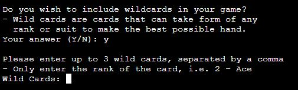
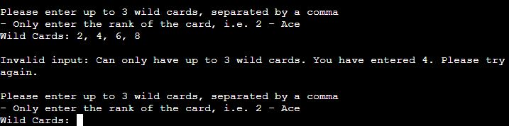

# Manual testing of Python Poker

## Introduction

There are several sections of Python Poker that require user input, each having their own set of rules for the data to be valid

For each input, the following will be tested:
- No input will be given
- An input only containing white space (" ") will be given
- Each rule will be broken, depending on the section
- Every valid input will also be entered to ensure they work

For the purposes of testing Python Poker, the following will be defined as:
- *Invalid input*: Any input that asks the user to re-enter their input, correcting their mistakes
- *Valid input*: Any input that triggers the program to move to a different section

## Section 1: Yes or No Questions

Upon starting the program, the user is first asked a yes or no question on whether they want to include wild cards in their round.

Note: All input requests that are accompanied by the text "Your Answer (Y/N): " use the same function `user_allows()`, which always returns a boolean value (Yes = True, No = False) and takes in no parameters that directly affect the algorithm. What this means is that these input requests use the exact same function to get a yes or no answer from the user with zero differences, so it is unnecessary to document every test case on all of them

Rules:
- 75% of the characters of the input must contain "Yes" or "No"
- The input must start with either "Y" or "N"

### Invalid Inputs

**Test 1: No input**

**Test 2: White space input**

**Test 3: Input that program does not expect**

**Test 4: Different word that contains an answer**

- "Yesterday" contains "Yes", which is a valid input
- However, at least 75% of the characters in the input must exist in the word (In this case, "Yes")
- Only 33% of the input contains "Yes", so the word is invalid
- The input would also be invalid if the user entered "Yeah" (50%) or "Nope" (Compared to "No": also 50%)

**Test 5: First letters do not match**

- "eYs" has a 100% letter match with "Yes"
- However, I decided that when it comes to spelling mistakes, it is very uncommon for people to misspell the first letter
- Therefore, it is safe to assume that if the user enters a different first letter, they mean something else
- Non matching first letters will result in the input failing to match the words

**Test 6: Repeating characters that matches an answer**

- At first glance, "Yessss" looks like a valid input since 100% of the letters in the input are in "Yes"
- However, each letter in the answer can only be matched with once, so after the "s" in "Yes" is found, any "s" after will not count
- This brings the matching letters down to 50% in this case, which is not considered a word match

### Valid Inputs

**Test 1: User enters "Yes"**

- When the user enters "Yes", the program will proceed to request the ranks of wild cards the user wishes to have

**Test 2: User enters "No"**

- When the user enters "No", the program will skip the wild card section and move to entering the first player's name

**Test 3: User enters part of answer**

- "y" is a valid input because the first letter of the input (In this case, the only letter) is the same as the first letter of the word,
and 100% of the input is in "Yes"
- Also note the word comparison is not case sensitive
- This also works for the "No" answer ("n")

## Section 2: Wild Cards

This section of the program only runs if the user answers Section 1 with a "Yes" input. It requests a list of wildcards that will be used in the upcoming round

Rules:
- Each wild card input must contain at least 1 rank (Any number between 2 and 10, or "Jack", "Queen", "King" or "Ace")
- The wild cards should be separated by a comma
- No more than 3 wild cards can be entered

### Invalid Inputs

**Test 1: No rank in any wild card**

- The user will be told that the first invalid card rank contains no ranks
- Note that "Pick" and "Sticks" contain the letter "k", which could be attributed to "King".
- However, "k" is not the first letter of these words, so the program correctly identifies them as not this rank

**Test 2: More than 3 wild cards**

- The user will be reminded about how many wild cards they can enter, and told how many cards they actually entered

**Test 3: Blank wild card**

**Test 4: Multiple ranks in one wild card**

- If more than one rank is found in an input, then each rank found will be shown to the user, allowing them to correct their mistake easier

### Valid Inputs

**Test 1: No input**

- In this section, no input is actually a valid input as for this case, the program will assume the user may have changed their mind about including wild cards.

**Test 2: White space input**

- A white space ("  ") input is treated the exact same as if the user entered no input at all

**Test 3: No commas separating ranks**

- Despite what the instructions suggest, commas are not necessary to enter wild cards
- However, if the user enters a list of wildcards without using commas and one of the ranks is invalid,
the program will not notify the user that there was an error and continue without using the invalid card
- Giving the user feedback on any invalid input is why separating ranks with commas is recommended

- Also, if multiple ranks are found in one word, without commas the program will use all ranks found

- I decided to keep this feature for users more familiar with the program, who are less likely to make mistakes
- This feature reduces the amount of characters needed to type for this input

**Test 4: No commas or spaces separating ranks**

- If the user doesn't have any commas or spaces, the program searches for each rank in the string
- Again, while this works, the program doesn't recommend it to new players because if they make a mistake, it can result in unintended ranks detected

- This was left in for users more experienced with the program, as they won't need to enter a comma or space for each rank

**Test 5: Trying all valid ranks**

- Note: All possible amounts of wild cards (1 - 3 per round) are also being tested here

2:

3 and 4:

5, 6 and 7:

8, 9 and 10:

Jack, Queen and King:

Ace:

**Test 6: Misspelling worded ranks**

- This section uses the same function as the word interpreter described in Section 1.
- Above, all first letters of the misspelled words are the same as the intended ranks,
and 100% of the characters exist in these ranks, so they are a match

**Test 7: Comma at end of input**

- It is possible that the user could enter a comma after every rank, including the last one
- If there is no text (or is only white space) after the last comma,
the program does not consider what is after the comma a blank card, which would make the input invalid

## Section 3: Proceeding Without Wildcards

- If the user doesn't enter any wild cards when prompted, the program will ask the user if they want to continue without wild cards
- This is a yes/no question that uses the function `user_allows()`.
To see all invalid inputs, see "Section 1: Yes or No Questions"
- Here, we will only be testing the valid ranks (True/False) to see if they result in moving to the intended sections

**Test 1: User enters "Yes"**

- If "Yes", the program will skip the wild card section as if the user originally entered "No" for wild cards

**Test 2: User enters "No"**

- If "No", the program will allow the user to enter wild cards once again

## Section 4: Name Request

- After successfully moving from the wild card section, the user will then be asked to enter their name
- Each hand has a player name, in order to tell the user which player is the winner

![Requesting the user for a name]

Rules:
- The name must be 12 characters or under
- If more than one player is entered, each name must be unique (Different cases are acceptable)

### Invalid Inputs

**Test 1: No input**

**Test 2: White space input**

**Test 3: More than 12 characters**

**Test 4: Using a name already taken**

### Valid Inputs

**Test 1: Entering a name that meets all requirements**

## Section 5: Hand Request with No Prior Players

- Once a valid name is entered, the program will move on to getting that player's cards

Rules:
- The hand must contain between 5 and 8 cards
- Each card must contain a rank and a suit
- Each card must be separated by a comma (unlike with wild cards where it is only recommended)
- Only one rank and suit should be entered
- No card should exist more than once in the hand

### Invalid Inputs

**Test 1: No input**

**Test 2: White space input**

**Test 3: Entering a normal string**

- The program treats a simple string as a single input, and tells the user they need more cards

**Test 4: Entering too many cards**

- The program evaluates how many inputs have been entered before checking if any are valid.
This is why there is no error about only entering numbers
- Also note the error message sentence changes depending on if the user enters not enough or too many cards

**Test 5: Empty string for card**

**Test 6: One invalid card entered**

- The program first checks for ranks in a card, which is why it does not mention that there are also no suits present

**Test 7: No rank detected in a card**

- The same result occurs for an invalid rank as if the card is completely invalid, as seen in Test 6 above

**Test 8: No suit detected in a card**

- The same error message is shown as if there were no ranks found, except "rank" is changed to "suit"

**Test 9: Multiple different cards found in one input**

- If multiple cards are found in a single input, every card found will be shown in a list.
- This makes it easier for the user to find where their mistake was

**Test 10: No commas to divide the cards**

- Unlike with the wild card section, cards need to have a comma between them because
there is 2 different types of information to get from each input: the rank and the suit
- If commas were not present here, the program could mix up the different ranks and suits to get cards the user did not intend to enter
- If commas aren't used, the program will treat the input as one card

**Test 11: A card in the hand exists twice**

- Only one of each card exists in the deck, so the user cannot have more than one

### Valid Inputs

**Test 1: Entering a valid hand**

- When a valid input is entered, the program displays all of the hands entered in a table,
and asks if the user wants to add another hand

**Test 2: Misspelling ranks and suits**

- This input request uses the same word interpreter as the one mentioned in the previous sections
- In the image above, Each rank and suit contains at least 75% of the word it is trying to represent
- If there are no spaces, the rank or suit will then be searched for in the string
- The rank and suit that takes up the most amount of characters in the input will be chosen

**Test 3: Comma at end of hand**

- If a comma is entered at the end, what is after that comma won't be treated like a blank card

**Test 4: "Random"**

- If the user enters "random", they will be dealt a random hand

**Test 5: "Random" misspelled**

- The word interpreter will still recognise "rnadm" as "random", and deal a random hand as normal
- This also works if the user simply enters the letter "r"

## Section 6: Displaying the Hands

## Section 7: Displaying the Winner

## Section 8: Adding Another Hand

## Section 9: Hand Request with Prior Players

## Section 10: Starting Another Round